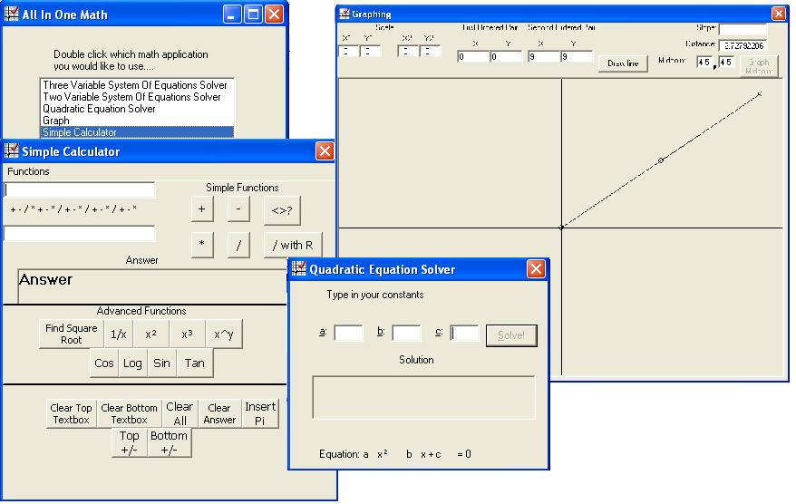



## All In One Math \(useful math program\)

### Description

This program is called All In One Math. I made it a while ago when school was still in

so that it could help me with algebra 2 honors homework. It has a lot of tools that help

you solve math problems such as quadratic equations and system of equations.

It also has a calculator that used to be my Talking Calculator with Merlin. I took out

Merlin and added a few more functions. It also has a graph that will plot a line that

you put in and it will tell you the slope, the distance between the two points and the

midpoint of the line segment.
 
### More Info
 

             |
---                |---
**Submitted On**   |2007-06-28 08:48:40
**By**             |[The O](https://github.com/Planet-Source-Code/PSCIndex/blob/master/ByAuthor/the-o.md)
**Level**          |Intermediate
**User Rating**    |5.0 (25 globes from 5 users)
**Compatibility**  |VB 6\.0
**Category**       |[Math/ Dates](https://github.com/Planet-Source-Code/PSCIndex/blob/master/ByCategory/math-dates__1-37.md)
**World**          |[Visual Basic](https://github.com/Planet-Source-Code/PSCIndex/blob/master/ByWorld/visual-basic.md)
**Archive File**   |[All\_In\_One2073016282007\.zip](https://github.com/Planet-Source-Code/the-o-all-in-one-math-useful-math-program__1-68896/archive/master.zip)

